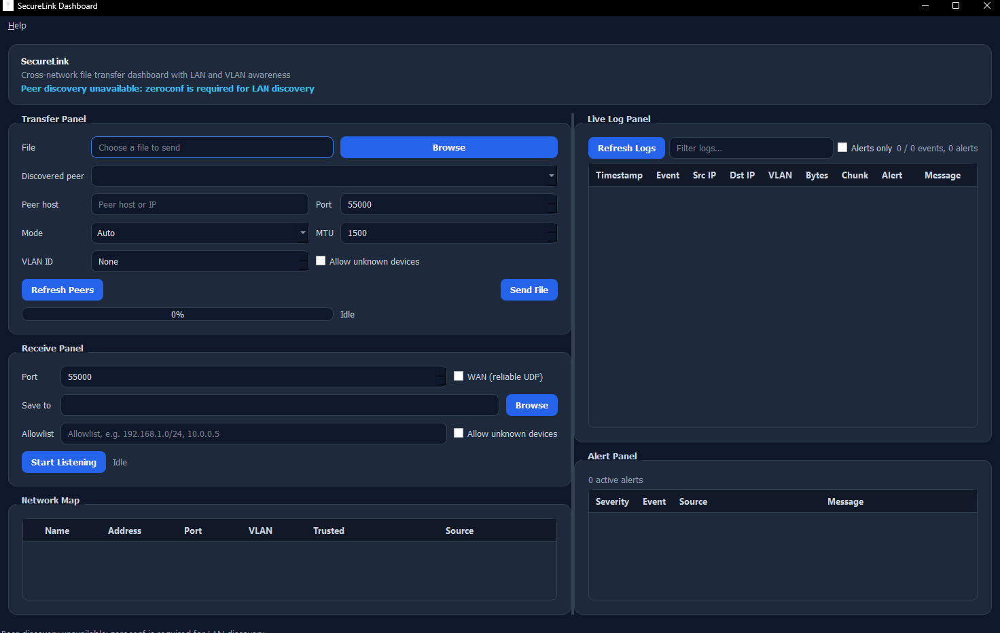
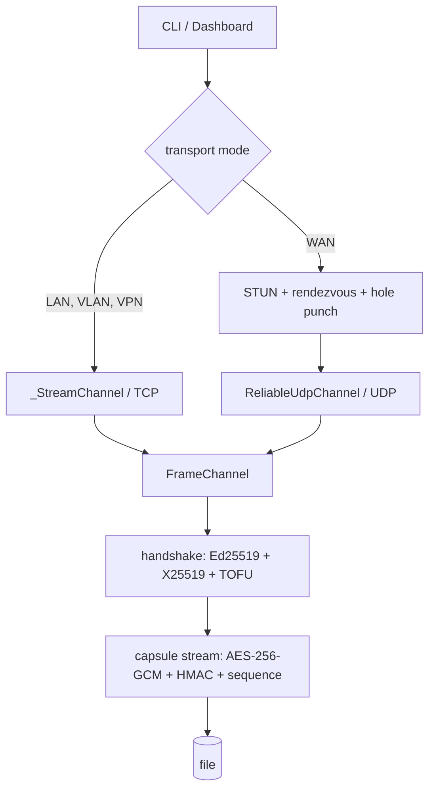

# SecureLink

SecureLink is a Python file-transfer tool for LAN, VLAN, and WAN. Every transfer is mutually authenticated, encrypted per chunk, and audit-logged, and the same security envelope runs over TCP on a LAN and over a reliable-UDP transport across the internet.

LAN and VLAN use direct TCP. WAN uses reliable UDP (selective-repeat windowed ARQ) with an RFC 8489 STUN client, a TCP rendezvous for endpoint signaling, and simultaneous-open UDP hole punching. A TURN-style relay for symmetric NATs is not bundled (see Known Limitations).

**Docs:** [User Manual](docs/MANUAL.md) · [FAQ](docs/FAQ.md)

## Getting started in 60 seconds

1. **Install:** `pip install "cryptography>=42" "scapy>=2.5" "zeroconf>=0.132" "PyQt5>=5.15" "pytest>=8"`
2. **Launch:** double-click the **SecureLink Dashboard** shortcut, or run `python -m ui.dashboard`.
3. **Receive (machine B):** in the Receive panel set a port and click **Start Listening** (tick **Allow unknown devices** on first contact).
4. **Send (machine A):** choose a file, enter machine B's IP and port, click **Send File**.

The manual and FAQ are also in the app under **Help** in the menu bar.



## What It Does

| Mode | Transport | Discovery / Control |
| --- | --- | --- |
| LAN | Direct TCP, jumbo-frame-aware chunking | mDNS peer discovery |
| WAN | Reliable UDP (selective-repeat windowed ARQ) + STUN endpoint discovery | Manual peer entry |
| VLAN | TCP transfer with VLAN policy checks | Per-VLAN ACL metadata |

## Security Features

| Feature | Implementation |
| --- | --- |
| End-to-end encryption | AES-256-GCM per chunk |
| Key exchange | X25519 ephemeral Diffie-Hellman + HKDF-SHA256 |
| Capsule integrity | HMAC-SHA256 over header + nonce + ciphertext |
| Replay prevention | Per-session sequence tracker with sliding window |
| Device identity | Ed25519 keypair, Trust-On-First-Use (TOFU) |
| VLAN enforcement | 802.1Q policy validation and per-VLAN ACLs |
| MITM detection | ARP spoof monitoring + TTL anomaly alerts |
| Audit logging | Structured JSON logs under `~/.securelink/logs/` |

## Status

A working prototype with a CLI and a PyQt5 dashboard. LAN, VLAN, and WAN transfers all run; the WAN path is exercised over loopback and against a packet-loss harness, not across real NATs. The test suite (`pytest`) is green. This is a learning/portfolio build, not hardened for production — see Known Limitations.

## Architecture

Three packages with one-way dependencies: `ui` → `core` + `security`. `core`
performs the transfer, `security` does passive monitoring, and neither depends
on `ui`.

### One envelope, two transports

Every transport implements `FrameChannel`: send and receive length-delimited
byte frames. The handshake, manifest exchange, and encrypted capsule stream are
written once against that interface (`stream_send` / `stream_receive` in
`transport.py`) and run unchanged over either backing transport:

- **`_StreamChannel`** wraps a TCP socket (LAN, VLAN); TCP supplies ordering and
  reliability.
- **`ReliableUdpChannel`** (`udp_transport.py`) gives the same guarantees over
  UDP for WAN, adding its own selective-repeat ARQ, RTT-adaptive retransmit
  timeout (RFC 6298 + Karn), and AIMD congestion window.

A "mode" is just which channel is used; the security envelope above it is
identical.



### Lifecycle of a transfer

1. **Select mode** — `auto_select_transport_mode` chooses LAN, VLAN, VPN, or WAN
   from the peer address and VLAN id; `--wan` or the dashboard can override it. A
   peer in the Tailscale/CGNAT range (`100.64.0.0/10`) is treated as VPN.
2. **Connect** — LAN/VLAN/VPN open a TCP connection; WAN binds a UDP socket (and,
   for NAT'd peers, runs the setup below).
3. **Handshake** — each side sends its Ed25519 identity key, an X25519 ephemeral
   key, a nonce, and a signature over both keys. Each verifies the signature,
   applies Trust-On-First-Use against `known_hosts.json`, then derives the
   session key with HKDF salted by both nonces.
4. **Manifest** — the sender sends filename, size, and mode.
5. **Stream** — the file is chunked into capsules (`capsule.py`): a GRE-style
   header, an HMAC over header + nonce + ciphertext, and an AES-256-GCM payload.
   The receiver checks the HMAC before decrypting; a per-session sequence tracker
   rejects replays and out-of-window gaps.

### WAN and NAT traversal

A directly reachable peer (port-forwarded, or UDP-reachable on the LAN) needs no
setup — `udp_send_file` / `udp_receive_file` use `ReliableUdpChannel` straight
away. For peers behind NAT, `nat.py` establishes the path first:

1. each peer learns its public `ip:port` from a STUN server (`stun.py`);
2. both contact a TCP rendezvous with a shared token, which swaps their
   endpoints;
3. each fires UDP probes at the other's endpoint until traffic flows both ways
   (simultaneous open).

`wan_connect` returns the punched socket, handed to `ReliableUdpChannel` like any
other. There is no relay fallback for symmetric NATs.

### Over a VPN (the easy path across the internet)

If both machines are on the same VPN (WireGuard, Tailscale, …) they already see
each other on a stable virtual link, so SecureLink skips NAT traversal entirely
and uses **direct TCP** — the most reliable option. WireGuard/OpenVPN hand out
private IPs (`10.x` / `192.168.x`) that already route as LAN; Tailscale's
`100.64.0.0/10` range is recognised as **VPN** mode so it routes over TCP rather
than the WAN UDP path. `discovery.py` adds two conveniences:

- `local_reachable_addresses()` — lists this host's reachable IPs (LAN / VPN /
  public), so the receiver knows which address to hand the sender. The dashboard
  Receive panel shows it as **Your address**.
- `tailscale_peers()` — when the `tailscale` CLI is present, lists tailnet peers
  (parsed from `tailscale status --json`) so they appear in the Network Map
  alongside mDNS peers. The `scan` command merges them too.

### Passive monitoring

The `security` guards observe traffic out of band with Scapy: ARP-table changes
(spoofing), TTL drops (a possible interception hop), and 802.1Q policy
violations. Events are appended as JSON under `~/.securelink/logs/`, which the
CLI `logs` command and the dashboard render.

## Capsule Wire Format

```text
┌──────────────────────────────────────────────────────────────┐
│  GRE Header       8 bytes   flags · protocol · chunk_id      │
├──────────────────────────────────────────────────────────────┤
│  HMAC-SHA256     32 bytes   over (header + nonce + cipher)   │
├──────────────────────────────────────────────────────────────┤
│  AES-GCM nonce   12 bytes   random per chunk                 │
├──────────────────────────────────────────────────────────────┤
│  Ciphertext       N bytes   AES-256-GCM, 16-byte tag appended│
└──────────────────────────────────────────────────────────────┘
```

The capsule has a 52-byte fixed prefix, and the AES-GCM authentication tag is appended to the ciphertext.

## Project Structure

```text
securelink/
├── core/
│   ├── crypto.py        X25519 key exchange, AES-256-GCM, HMAC helpers
│   ├── capsule.py       GRE capsule format, sequence tracking, MTU helpers
│   ├── auth.py          Ed25519 identity, TOFU, known_hosts
│   ├── discovery.py     mDNS announce + scan
│   ├── stun.py          RFC 8489 STUN client (public-endpoint discovery)
│   ├── transport.py     TCP transfer + shared channel/handshake/streaming
│   ├── udp_transport.py Reliable-UDP (WAN) transport, selective-repeat ARQ
│   └── nat.py           STUN rendezvous + UDP hole punching (wan_connect)
├── security/
│   ├── capture.py       Scapy packet capture, JSON event logging
│   ├── arp_guard.py     ARP table baseline + spoof detection
│   ├── ttl_guard.py     TTL recording + anomaly alerting
│   └── vlan_guard.py    802.1Q policy validation, per-VLAN ACL engine
├── ui/
│   ├── cli.py           CLI entrypoint (argparse)
│   └── dashboard.py     PyQt5 GUI dashboard
├── SecureLink.bat       One-click launcher (just double-click)
├── config/
│   └── vlan_policy.json Per-VLAN ACL rules
├── assets/
│   └── securelink.ico   Application / taskbar icon
├── scripts/
│   └── run_dashboard.pyw Launcher implementation (no console)
├── docs/
│   ├── MANUAL.md        User manual
│   ├── FAQ.md           Common questions
│   └── screenshots/     Dashboard screenshot
├── tests/
│   ├── test_crypto_capsule.py
│   ├── test_transport_modes.py
│   ├── test_udp_transport.py
│   ├── test_udp_reliability.py
│   ├── test_stun.py
│   ├── test_nat.py
│   ├── test_discovery.py
│   ├── test_identity.py
│   ├── test_guards.py
│   ├── test_cli.py
│   └── test_dashboard.py
├── LICENSE
└── README.md
```

## Install

Python 3.11+ and five dependencies:

- `cryptography` — X25519/Ed25519, AES-256-GCM, HKDF, HMAC
- `scapy` — packet capture for the ARP/TTL/VLAN guards
- `zeroconf` — mDNS peer discovery
- `PyQt5` — dashboard GUI
- `pytest` — test suite

```bash
pip install "cryptography>=42" "scapy>=2.5" "zeroconf>=0.132" "PyQt5>=5.15" "pytest>=8"
```

## Usage

### CLI

```bash
# Send a file over LAN
python -m ui.cli send sample.bin 192.168.1.10

# Send over a VLAN-scoped path
python -m ui.cli send sample.bin 192.168.1.50 --vlan 30

# Send over WAN (reliable UDP)
python -m ui.cli send sample.bin 203.0.113.10 --wan --port 55000

# Send over a VPN (e.g. a Tailscale address) — auto-detected as direct TCP
python -m ui.cli send sample.bin 100.101.0.5

# Send to an unknown peer without an interactive trust prompt
python -m ui.cli send sample.bin 192.168.1.10 --allow-unknown

# Receive a file
python -m ui.cli recv --port 55000

# Receive over WAN (reliable UDP)
python -m ui.cli recv --wan --port 55000

# Receive into a directory, restricted to an allowlist
python -m ui.cli recv --port 55000 --output-dir ./inbox --allowlist 192.168.1.0/24

# Discover this host's public IP:port via STUN
python -m ui.cli stun --stun-host stun.l.google.com --stun-port 19302

# Classify this host's NAT — will direct WAN hole punching work, or use a VPN?
python -m ui.cli natcheck

# Isolate identity/known_hosts/session/logs under a chosen directory
python -m ui.cli --help  # --state-dir is available on every subcommand
python -m ui.cli status --state-dir ./demo-state

# Scan for peers on LAN
python -m ui.cli scan

# View security logs
python -m ui.cli logs --alerts-only

# Show session stats
python -m ui.cli status
```

### Dashboard

```bash
python -m ui.dashboard
```

On Windows the easiest way is to just double-click **`SecureLink.bat`** in the
project folder — no terminal or commands needed. You can also use the
**SecureLink Dashboard** Start Menu / Desktop shortcut. (Both launch the GUI
with `pythonw`, so no console window appears.) The dashboard both sends files
and listens for incoming
transfers (LAN or WAN, with start/stop), alongside the discovered-peer map, live
logs, and alerts.

## VLAN Policy

Edit `config/vlan_policy.json` to define inter-VLAN transfer rules.

Example:

```json
{
  "10": [10, 20],
  "20": [20],
  "30": [10, 30]
}
```

This file is loaded as a simple source-VLAN to allowed-destination map. Policy is deny-by-default. VLAN support in SecureLink is policy enforcement and metadata, not tagged frame generation.

## Running Tests

```bash
pytest tests/ -v
```

## Known Limitations

- WAN reliability is selective-repeat windowed ARQ (up to 32 frames in flight): per-frame ACKs, out-of-order receive buffering, retransmission of only the overdue frames, and a graceful-close linger that recovers a dropped final ACK. It is verified against 25% bidirectional packet loss. The retransmit timeout adapts to measured RTT (RFC 6298, with Karn's algorithm and exponential backoff), and the send window is an AIMD congestion window with slow start (halving on loss). Loss recovery is timeout-driven; a SACK-based fast-retransmit would recover quicker than waiting for the RTO and is the natural refinement.
- WAN NAT traversal is coordinated end to end (`core/nat.py`): STUN endpoint discovery, a TCP rendezvous that swaps the two peers' endpoints by token, and simultaneous-open UDP hole punching via `wan_connect`. Not bundled: a TURN-style relay fallback for symmetric NATs where hole punching cannot succeed. The path is verified on loopback, not across real NATs.
- VLAN mode validates policy and metadata, not L2 802.1Q tagged frame generation.

## Notes

A portfolio project. The parts worth reading are the `FrameChannel` abstraction
in `core/transport.py` — one authenticated, encrypted path shared by the TCP and
UDP transports — and the from-scratch reliable-UDP transport in
`core/udp_transport.py` (selective-repeat ARQ, RFC 6298 RTO, AIMD congestion
control), built and debugged against a packet-loss test harness.

## License & Disclaimer

Released under the [MIT License](LICENSE) — Copyright © 2026 Firas Bech. The
software is provided "as is", without warranty of any kind; see the license for
the full text.

SecureLink includes network-monitoring features (packet capture, ARP and TTL
inspection). Use them only on networks and devices you own or are explicitly
authorized to monitor. You are responsible for complying with all applicable
laws and regulations.
