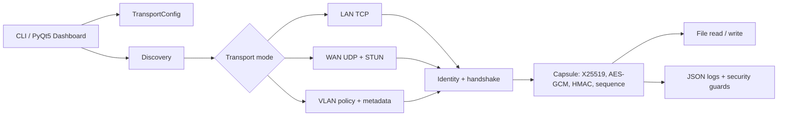

# SecureLink

SecureLink is a security-focused Python file transfer tool for LAN, WAN, and enterprise VLAN environments. It demonstrates authenticated encryption, session identity, packet inspection, and audit logging for cross-network file transfer.

LAN and VLAN use direct TCP transfer. WAN uses a reliable-UDP transport (selective-repeat windowed ARQ over UDP) with a built-in RFC 8489 STUN client, a TCP rendezvous for endpoint signaling, and simultaneous-open UDP hole punching. A TURN-style relay fallback (for symmetric NATs) is not bundled; see Known Limitations.

## What It Does

| Mode | Transport | Discovery / Control |
| --- | --- | --- |
| LAN | Direct TCP, jumbo-frame-aware chunking | mDNS peer discovery |
| WAN | Reliable UDP (selective-repeat windowed ARQ) + STUN endpoint discovery | Manual peer entry |
| VLAN | TCP transfer with VLAN policy checks | Per-VLAN ACL metadata |

## Security Features

| Feature | Implementation |
| --- | --- |
| End-to-end encryption | AES-256-GCM per chunk |
| Key exchange | X25519 ephemeral Diffie-Hellman + HKDF-SHA256 |
| Capsule integrity | HMAC-SHA256 over header + nonce + ciphertext |
| Replay prevention | Per-session sequence tracker with sliding window |
| Device identity | Ed25519 keypair, Trust-On-First-Use (TOFU) |
| VLAN enforcement | 802.1Q policy validation and per-VLAN ACLs |
| MITM detection | ARP spoof monitoring + TTL anomaly alerts |
| Audit logging | Structured JSON logs under `~/.securelink/logs/` |

## Project Status

SecureLink is currently implemented as a working file transfer prototype with a PyQt5 dashboard, CLI entrypoint, and verified transport coverage for LAN, VLAN, and WAN (reliable-UDP) loopback paths.

Verified in this workspace:

- Core crypto, capsule, auth, discovery, STUN, transport, UDP transport, guard, and UI modules are in place.
- LAN, VLAN, and WAN (reliable-UDP) loopback tests pass, and the STUN codec is unit-tested.
- The dashboard launches with `python -m ui.dashboard`.
- The full test suite is green.

Current caveats:

- WAN reliability is a selective-repeat windowed ARQ, verified under simulated bidirectional packet loss.
- NAT hole-punch coordination needs an out-of-band signaling exchange, and no TURN-style relay is bundled.
- VLAN support is policy enforcement and metadata, not 802.1Q tagged frame generation.

## Architecture



## Capsule Wire Format

```text
┌──────────────────────────────────────────────────────────────┐
│  GRE Header       8 bytes   flags · protocol · chunk_id      │
├──────────────────────────────────────────────────────────────┤
│  HMAC-SHA256     32 bytes   over (header + nonce + cipher)   │
├──────────────────────────────────────────────────────────────┤
│  AES-GCM nonce   12 bytes   random per chunk                 │
├──────────────────────────────────────────────────────────────┤
│  Ciphertext       N bytes   AES-256-GCM, 16-byte tag appended│
└──────────────────────────────────────────────────────────────┘
```

The capsule has a 52-byte fixed prefix, and the AES-GCM authentication tag is appended to the ciphertext.

## Project Structure

```text
securelink/
├── core/
│   ├── crypto.py        X25519 key exchange, AES-256-GCM, HMAC helpers
│   ├── capsule.py       GRE capsule format, sequence tracking, MTU helpers
│   ├── auth.py          Ed25519 identity, TOFU, known_hosts
│   ├── discovery.py     mDNS announce + scan
│   ├── stun.py          RFC 8489 STUN client (public-endpoint discovery)
│   ├── transport.py     TCP transfer + shared channel/handshake/streaming
│   ├── udp_transport.py Reliable-UDP (WAN) transport, selective-repeat ARQ
│   └── nat.py           STUN rendezvous + UDP hole punching (wan_connect)
├── security/
│   ├── capture.py       Scapy packet capture, JSON event logging
│   ├── arp_guard.py     ARP table baseline + spoof detection
│   ├── ttl_guard.py     TTL recording + anomaly alerting
│   └── vlan_guard.py    802.1Q policy validation, per-VLAN ACL engine
├── ui/
│   ├── cli.py           CLI entrypoint (argparse)
│   └── dashboard.py     PyQt5 GUI dashboard
├── config/
│   └── vlan_policy.json Per-VLAN ACL rules
├── tests/
│   ├── test_crypto_capsule.py
│   ├── test_transport_modes.py
│   ├── test_udp_transport.py
│   ├── test_udp_reliability.py
│   ├── test_stun.py
│   ├── test_nat.py
│   ├── test_discovery.py
│   ├── test_identity.py
│   ├── test_guards.py
│   ├── test_cli.py
│   └── test_dashboard.py
├── requirements.txt
├── CLAUDE.md
└── README.md
```

## Install

```bash
pip install -r requirements.txt
```

## Usage

### CLI

The command line entrypoint is `python -m ui.cli`.

Examples:

```bash
# Send a file over LAN
python -m ui.cli send sample.bin 192.168.1.10

# Send over a VLAN-scoped path
python -m ui.cli send sample.bin 192.168.1.50 --vlan 30

# Send over WAN (reliable UDP)
python -m ui.cli send sample.bin 203.0.113.10 --wan --port 55000

# Send to an unknown peer without an interactive trust prompt
python -m ui.cli send sample.bin 192.168.1.10 --allow-unknown

# Receive a file
python -m ui.cli recv --port 55000

# Receive over WAN (reliable UDP)
python -m ui.cli recv --wan --port 55000

# Receive into a directory, restricted to an allowlist
python -m ui.cli recv --port 55000 --output-dir ./inbox --allowlist 192.168.1.0/24

# Discover this host's public IP:port via STUN
python -m ui.cli stun --stun-host stun.l.google.com --stun-port 19302

# Isolate identity/known_hosts/session/logs under a chosen directory
python -m ui.cli --help  # --state-dir is available on every subcommand
python -m ui.cli status --state-dir ./demo-state

# Scan for peers on LAN
python -m ui.cli scan

# View security logs
python -m ui.cli logs --alerts-only

# Show session stats
python -m ui.cli status
```

### Dashboard

```bash
python -m ui.dashboard
```

## VLAN Policy

Edit `config/vlan_policy.json` to define inter-VLAN transfer rules.

Example:

```json
{
  "10": [10, 20],
  "20": [20],
  "30": [10, 30]
}
```

This file is loaded as a simple source-VLAN to allowed-destination map. Policy is deny-by-default. VLAN support in SecureLink is policy enforcement and metadata, not tagged frame generation.

## Running Tests

```bash
pytest tests/ -v
```

## Known Limitations

- WAN reliability is selective-repeat windowed ARQ (up to 32 frames in flight): per-frame ACKs, out-of-order receive buffering, retransmission of only the overdue frames, and a graceful-close linger that recovers a dropped final ACK. It is verified against 25% bidirectional packet loss. The retransmit timeout adapts to measured RTT (RFC 6298, with Karn's algorithm and exponential backoff), and the send window is an AIMD congestion window with slow start (halving on loss). Loss recovery is timeout-driven; a SACK-based fast-retransmit would recover quicker than waiting for the RTO and is the natural refinement.
- WAN NAT traversal is coordinated end to end (`core/nat.py`): STUN endpoint discovery, a TCP rendezvous that swaps the two peers' endpoints by token, and simultaneous-open UDP hole punching via `wan_connect`. Not bundled: a TURN-style relay fallback for symmetric NATs where hole punching cannot succeed. The path is verified on loopback, not across real NATs.
- VLAN mode validates policy and metadata, not L2 802.1Q tagged frame generation.

## Skills Demonstrated

`Python` `TCP/IP` `AES-256-GCM` `X25519` `HMAC-SHA256` `GRE encapsulation`

`STUN RFC 8489` `UDP hole punching` `NAT traversal` `802.1Q VLAN`

`Scapy` `ARP monitoring` `mDNS` `Ed25519` `TOFU` `JSON audit logging`
